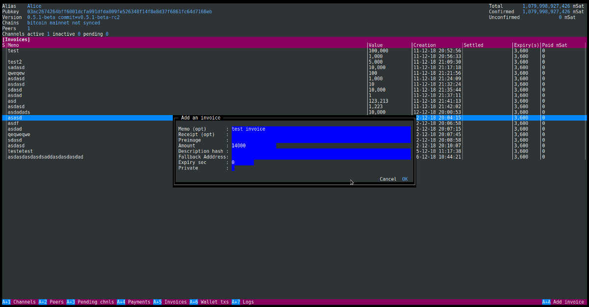

# lncli-curses
Terminal user interface for [lnd lightning daemon](https://github.com/lightningnetwork/lnd) written in go

## Features
- Channels, peers, pending channels, payments, invoices, wallet transactions views
- Close, open channels
- Connect, disconnect peers
- Create, pay invoices
- Create new wallet addresses

## Getting Started

### Prerequisites

- [golang](https://golang.org/) (1.10+) environment
- A working and unlocked lncli

### Building

```
$ go get github.com/lleny/lncli-curses
$ cd $GOPATH/src/github.com/lleny/lncli-curses
$ make
```

Example
```
$ ./lncli-curses --lnclicmd=/usr/local/bin/lncli --lnddir=/home/user/.lnd
```

### Usage

```
Usage:
  lncli-curses [OPTIONS]

Application Options:
  -l, --lnclicmd=        lncli executable (default: lncli)
  -r, --refresh=         lncli data refresh time in seconds (default: 60)
      --rpcserver=       host:port of ln daemon
      --lnddir=          path to lnd's base directory
      --tlscertpath=     path to TLS certificate
      --no-macaroons     disable macaroon authentication
      --macaroonpath=    path to macaroon file
      --macaroontimeout= anti-replay macaroon validity time in seconds
      --macaroonip=      if set, lock macaroon to specific IP address

Help Options:
  -h, --help             Show this help message
```

Navigation and actions are accessible through Alt+{shortcut key}
Navigation in the forms is done with Tab, Alt+Tab

## Screenshots


## TO-DO
- Stability improvement
- Form validation
- Datagrid sort
- Datagrid search
- ...

## Acknowledgements
 - [GOCUI](https://github.com/jroimartin/gocui) - Go Console User Interface

## License

This project is licensed under the GPL v3 - see the [LICENSE](LICENSE) file for details
