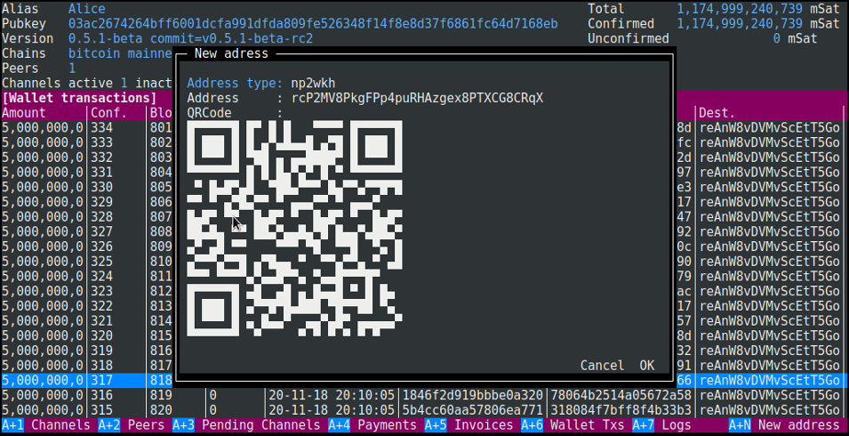
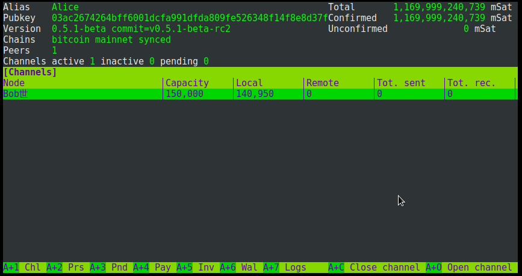

# lncli-curses
Terminal user interface for [lnd lightning daemon](https://github.com/lightningnetwork/lnd) written in go

## Features
- Channels, peers, pending channels, payments, invoices, wallet transactions views
- Close, open channels
- Connect, disconnect peers
- Create, pay invoices
- Create new wallet addresses
- Theming

## Getting Started

### Prerequisites

- [golang](https://golang.org/) (1.10+) environment
- A working and unlocked [lncli](https://github.com/lightningnetwork/lnd) (0.5.1) 

### Building

```
$ go get github.com/lleny/lncli-curses
$ cd $GOPATH/src/github.com/lleny/lncli-curses
$ make
```

Example
```
$ ./lncli-curses --lnclicmd=/usr/local/bin/lncli --lnddir=/home/user/.lnd
```

### Usage

```
Usage:
  lncli-curses [OPTIONS]

Application Options:
  -l, --lnclicmd=        lncli executable (default: lncli)
  -r, --refresh=         lncli data refresh time in seconds (default: 60)
      --rpcserver=       host:port of ln daemon
      --lnddir=          path to lnd's base directory
      --tlscertpath=     path to TLS certificate
      --no-macaroons     disable macaroon authentication
      --macaroonpath=    path to macaroon file
      --macaroontimeout= anti-replay macaroon validity time in seconds
      --macaroonip=      if set, lock macaroon to specific IP address

Help Options:
  -h, --help             Show this help message
```

Navigation and actions are accessible through Alt+{shortcut key}, navigation in the forms is done with Tab, Alt+Tab

## Screenshots


QR Code for new address and invoice


## Theming

Colors can be modified through modification of the config.json file. Colors are using [terminal escape sequences](https://misc.flogisoft.com/bash/tip_colors_and_formatting) 
```
"theme":
    {
        "background" :"1",
        "inverted" : "[48;5;21m",
        "highlight" : "[38;5;75m[48;5;0m",
        "error" : "[1m[38;5;196m",
        "labelHeader" : "[38;5;15m[48;5;0m",
        "normal" : "[38;5;15m[48;5;0m",
        "bold" : "[1m",
        "gridHeader" : "[48;5;89m[38;5;15m",
        "gridSelected" : "[48;5;33m[38;5;15m"
    },
```

Grid columns can also be renamed, removed, reordered, and adjusted in length through the same config.json file. A column with a width of 0 will use the available space equally shared between all the 0 width columns.
```
"channels" :
        {
            "header" : "[Channels]",
            "shortcutHeader" : "Channels",
            "columns" : [
                { "key": "Active", "header": "A", "width": 2 },
                { "key": "Private", "header": "P", "width": 2 },
                { "key": "Node", "header": "Node", "width": 0 },
                { "key": "Capacity", "header": "Capacity", "width": 13 },
                { "key": "Local", "header": "Local", "width": 13 },
                { "key": "Remote", "header": "Remote", "width": 13 },
                { "key": "ComFee", "header": "Com. fee", "width": 9 },
                { "key": "ComWeight", "header": "Com. weight", "width": 12 },
                { "key": "FeeKw", "header": "Fee/Kw", "width": 7 },
                { "key": "Unsettled", "header": "Unsettled", "width": 13 },
                { "key": "TotSent", "header": "Tot. sent", "width": 13 },
                { "key": "TotRec", "header": "Tot. rec.", "width": 13 }
            ]
        },
```

## TO-DO
- Stability improvement
- Form validation
- Datagrid sort
- Datagrid search
- ...

## Acknowledgements
 - [GOCUI](https://github.com/jroimartin/gocui) - Go Console User Interface

## License

This project is licensed under the GPL v3 - see the [LICENSE](LICENSE) file for details
